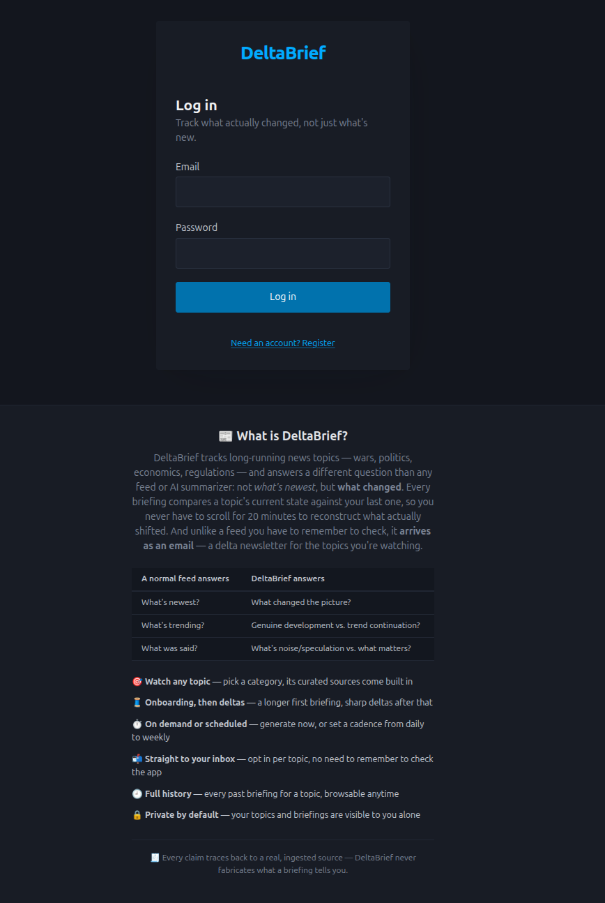
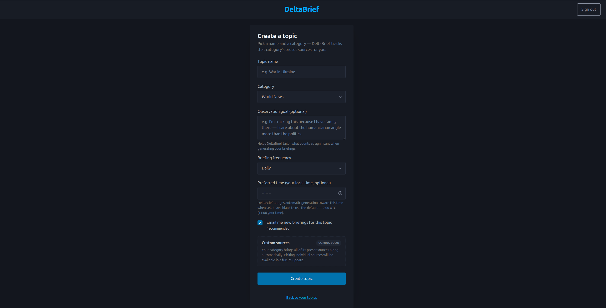
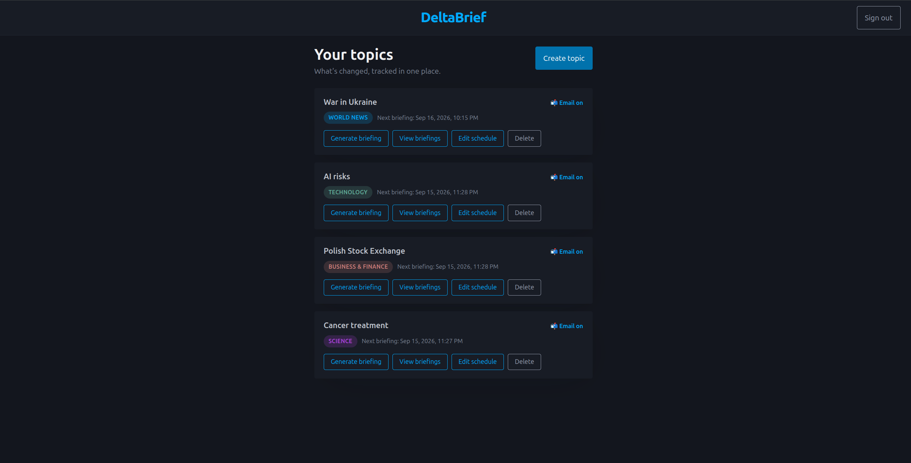
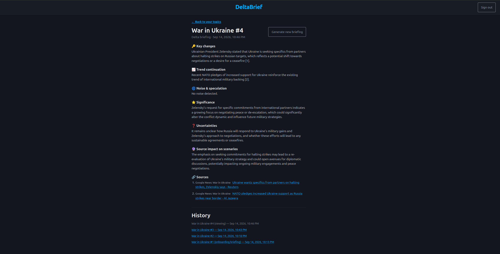
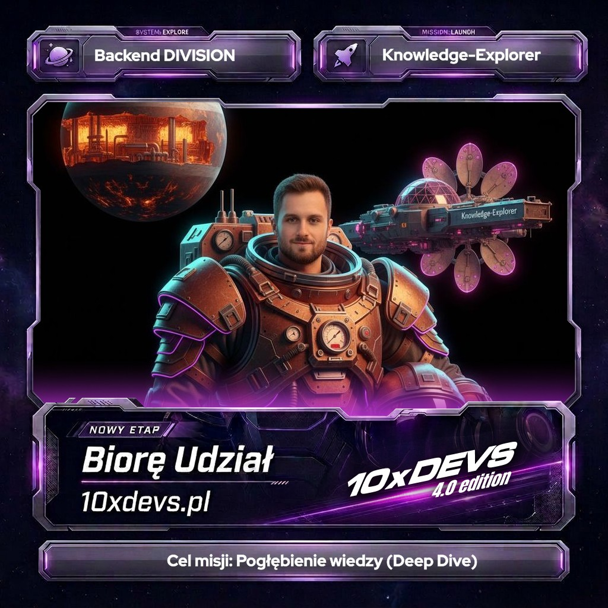

# DeltaBrief 📰

🔗 **Live app: [delta-brief.onrender.com](https://delta-brief.onrender.com/)** — it's up and running right now.
Register an account, create a topic, and try the delta-briefing loop yourself; feedback and bug reports are
welcome.

## Description

An agentically-developed web app built as part of the **[10xDevs](https://www.10xdevs.pl) course** and the
**10xBuilder certification**, exploring AI-agent-driven software delivery end to end — PRD, roadmap, planning,
implementation, and tests all produced through an agentic workflow rather than hand-written from scratch.

DeltaBrief tracks long-running news topics (wars, politics, economics, regulations, international relations) and
answers a different question than every feed or AI summarizer out there. Classic tools tell you **what's newest**.
DeltaBrief tells you **what changed** — it compares a topic's current state against your last briefing and
separates genuine change from noise, trend continuation, and speculation, so you don't have to scroll for
20 minutes to reconstruct it yourself. At its core, DeltaBrief is meant to be consumed as an **email newsletter**:
once you opt in, each delta briefing lands straight in your inbox on your topic's own schedule — the app itself
is there for setup and history, but the everyday product experience is the email hitting your inbox, not a
dashboard you have to remember to open.

Every claim in a generated briefing is traceable back to an ingested source — hallucination-free output is the
product's non-negotiable trust guarantee, not an afterthought.

> 📬 **Email delivery is core, not a bolt-on.** DeltaBrief is designed to work as your **delta newsletter**: once                                                                                                                     
> you opt in, every generated briefing lands in your inbox on your topic's own schedule, with zero need to open                                                                                                                       
> the app. The in-app view exists for browsing history and drilling into detail — the primary delivery channel                                                                                                                        
> the product is built around is email.

### 🧭 Why "delta," not "digest"

| Question a normal feed answers | Question DeltaBrief answers |
|---|---|
| What's newest? | What changed the picture? |
| What's trending? | What's a genuine development vs. trend continuation? |
| What was said? | What's noise/speculation vs. what actually matters? |

### 🧘 Informed, not overstimulated

DeltaBrief exists to keep you in the loop on the topics you actually care about — without the doomscrolling.
Endless feeds are optimized to maximize time-on-app, not your understanding: they re-serve the same story from
ten angles, mix in outrage-bait and speculation, and reward you for scrolling rather than for being informed.
DeltaBrief does the opposite on purpose. It only tells you what's genuinely new since you last checked, filters
out noise and trend-repetition, and delivers that once, on a schedule you set — so staying informed costs you a
two-minute read instead of a twenty-minute scroll, and checking a topic isn't a compulsive habit anymore.

## 📸 Screenshots

<table>
  <tr>
    <td align="center"><strong>Login — with the landing pitch</strong><br/></td>
    <td align="center"><strong>Create a topic</strong><br/></td>
  </tr>
  <tr>
    <td align="center"><strong>Your topics — color-coded by category</strong><br/></td>
    <td align="center"><strong>A delta briefing</strong><br/></td>
  </tr>
</table>

## ✨ Features

### Shipped

- **Account & session auth** — register with email/password, verify by email, log in and out. Sessions are
  server-side (Spring Security form login), not JWT — the app is a server-rendered site, not a public API.
- **Rate-limited auth endpoints** — registration and resend-verification are rate-limited per (email, IP) to
  resist enumeration and abuse.
- **Watched topics** — create a topic (e.g. "War in Ukraine"), assign it to a curated category
  (World News, Technology, Business & Finance, Science), and browse your topic list.
- **Preset source curation** — each category comes with a hand-curated set of RSS/Atom sources (BBC, Al Jazeera,
  The Guardian, TechCrunch, Ars Technica, CNBC, MarketWatch, ScienceDaily, and more). No custom feed entry in v1 —
  curation is deliberately manual to avoid feed-parsing/validation complexity. Curated sources are currently
  managed directly in the database by an administrator (there is no in-app source-management UI yet — see
  "Sources" under Configuration below).
- **Curated-first ingestion, Google News as a gap filler** — every briefing fetches all of the topic's
  category-curated sources *and* a live Google News RSS search scoped to the topic's own name, concurrently.
  Curated sources are the preferred citation authority: when generating the briefing, the model is instructed to
  cite a curated source whenever it adequately supports a claim, and only fall back to a Google News result once
  **no** curated source addresses that claim at all. Google News exists to fill coverage gaps a fixed, category-wide
  source list can't reach for a specific topic — not to compete with curation on equal footing.
- **Onboarding briefing** — the first briefing for a new topic: a longer initial-state summary that gives you
  enough context to actually understand future deltas.
- **Delta briefing** — every subsequent briefing classifies new content against the previous briefing into
  structured sections: key changes, trend continuation, noise/speculation, significance, uncertainties, source
  impact on scenarios, and sources. Empty sections render explicitly (e.g. "No noise detected") instead of being
  omitted, so the structure stays consistent and learnable across briefings.
- **On-demand and scheduled generation** — trigger a briefing anytime via "Generate briefing", or set a per-topic
  automatic cadence (daily, every other day, or weekly) with an optional preferred time of day. The time is
  picked in your own local timezone via a native time picker and converted to UTC automatically, so you never
  have to think in UTC yourself — leave it blank and DeltaBrief defaults to 9:00 UTC. Both the cadence and the
  email opt-in are editable anytime from a topic's "Edit schedule" page, no need to recreate the topic. A
  background scheduler polls for due topics and generates briefings automatically, capped to a small number of
  concurrent generations so scheduled runs never starve interactive requests.
- **Live generation feedback** — generation runs synchronously; the "Generate briefing" button disables itself and
  shows a busy spinner for the duration of the request (and a clear failure state if generation fails), so you're
  never left wondering whether anything is happening.
- **Briefing history** — browse every past briefing for a topic, onboarding and delta alike, not just the latest.
- **Email delivery (the delta newsletter)** — opt in per topic and every newly generated briefing — onboarding or
  delta — is delivered straight to your inbox via Resend's SMTP relay, on that topic's own schedule. This is the
  intended everyday way to consume DeltaBrief: no need to remember to check the app, the delta comes to you.
- **Per-user data isolation** — topics, sources, briefings, and schedules are private to the account that owns
  them; there is no cross-user visibility of topic selections or briefing content.

### Planned next

- **Rate a briefing** — react to each briefing with predefined categories (useful, too much noise, too little
  context, already knew this, not relevant to me), captured for future manual prompt tuning.
- **OAuth login (Google, Facebook)** — register/log in via Google or Facebook as an alternative to email/password,
  with account linking by verified email.
- **Deactivate a topic** — stop watching a topic without deleting its history (nice-to-have, parked behind the
  must-haves above).
- **User-side source customization** — let users pick individual sources within a category (or add their own),
  instead of every topic inheriting its whole category's curated set. Today, curated sources are administrator-
  managed directly in the database; this item would move that curation into the hands of end users.
- Deferred by design for now (tracked as explicit non-goals, not gaps): custom RSS feed management, real-time
  alerts/push notifications, multi-user collaboration or shared topics, and source bias/credibility scoring.

## 🚀 Getting Started

### Prerequisites

- [Java 21](https://openjdk.org/projects/jdk/21/) (JDK)
- [Docker](https://www.docker.com/get-started) (for local PostgreSQL via Docker Compose)
- A [Supabase](https://supabase.com/) Postgres project (production/staging datastore)
- An OpenAI API key (Spring AI / briefing generation)
- A [Resend](https://resend.com/) account + API key (email delivery)

### Cloning

```bash
git clone https://github.com/ninjarlz/delta-brief.git
```

### Configuration

Copy `.env.example` to `.env` and fill in the secrets it references (never commit `.env` — the LLM key and mail
credentials must come from the environment, never be hard-coded). Key variables:

| Variable | Purpose |
|---|---|
| `SPRING_DATASOURCE_URL` / `_USERNAME` / `_PASSWORD` | Postgres connection (local Docker Compose or Supabase) |
| `SPRING_AI_OPENAI_API_KEY` | Briefing generation via Spring AI's OpenAI starter |
| `RESEND_API_KEY` | Outbound email via Resend's SMTP relay |
| `MAIL_FROM_ADDRESS` | Verified "from" address for verification and briefing emails |
| `APP_BASE_URL` | Base URL used to build links in outgoing emails |

### Building

```bash
./gradlew build
```

### Running the application

#### 1. Start the database

```bash
docker compose up -d
```
Starts PostgreSQL on port `5433` locally, with Flyway migrating the schema automatically on app startup.

#### 2. Start the app

```bash
./gradlew bootRun
```
The app serves server-rendered pages (Thymeleaf) at `http://localhost:8080`. There is no public
JSON API — every route returns HTML, behind session-cookie auth with CSRF protection.

### Running tests

```bash
./gradlew test
```
Run a single test class:
```bash
./gradlew test --tests "pl.tul.deltabrief.<ClassName>"
```

## 🏗 Architecture

A **DDD modular monolith** under `pl.tul.deltabrief` — one package per bounded context, each internally layered
`domain` → `application` → `adapter.in.web` (Thymeleaf controllers) / `adapter.out.<concern>`
(persistence, AI, email, RSS). Dependencies point inward only; modules reference each other by ID
(e.g. `TopicId`, `UserId`), never by importing another module's domain aggregate.

> 🖥️ **Spring Boot + server-side rendering, not an API.** DeltaBrief is a classic server-rendered web app
> (Spring MVC + Thymeleaf; a small vanilla-JS helper disables and spinner-fies a form's submit button for the
> duration of a slow synchronous request, like briefing generation — no HTMX, no client-side framework) backed
> by session-based auth. There is no public REST/JSON API — every route returns HTML behind the session cookie,
> and the only non-HTML endpoint is the `/actuator/health` check Render uses. This is a deliberate MVP choice
> (see `tech-stack.md`), not a missing feature; a JSON API could be added later if a native app, SPA, or
> third-party integration ever needed one.

```
src/main/java/pl/tul/deltabrief/
  DeltaBriefApplication.java     — Spring Boot entry point
  auth/                           — registration, email verification, session login
  topic/                          — watched topics, categories, curated sources, schedule/frequency
  briefing/                       — core domain: onboarding + delta briefing generation and classification
  shared/                         — cross-cutting: email sending, rate-limit error handling
  config/                         — technical wiring (SecurityConfig, AsyncConfig, SchedulingConfig)
```

- **Domain layer** has zero Spring/HTTP/IO imports — plain Java classes and interfaces only.
- **Application layer** depends only on domain ports, never on infrastructure classes directly.
- **Infrastructure (`adapter.out.*`)** implements those ports and owns all framework annotations
  (JPA entities, Spring AI clients, RSS fetchers via ROME, the SMTP email sender).

### How a delta briefing gets made

1. `ScheduledBriefingRunner` (cron-polled, or triggered manually from the topic page) finds topics due for a run.
2. **Ingestion, curated-first:** every source in the topic's category (`FeedSourceCatalog`, DB-managed) is fetched
   concurrently, *plus* one topic-targeted Google News RSS search (`GoogleNewsSearchFeedProvider`) built from the
   topic's name. All fetched items are parsed (ROME) into `IngestedItem`s new since the last briefing and passed
   to the model together — nothing is pre-filtered by source at fetch time.
3. `BriefingService` loads the topic's previous briefing (if any) as the comparison baseline.
4. `BriefingPromptBuilder` assembles the prompt from the new items + prior briefing, labeling each source by name
   so the model can tell curated sources apart from the Google News feed, and instructs it to **prefer a curated
   source whenever one adequately supports a claim, falling back to Google News only for claims no curated
   source addresses at all** — curation wins by default; Google News is strictly a gap filler for what a
   fixed, category-wide source list misses about this specific topic. `OpenAiBriefingContentGenerator`
   (Spring AI, OpenAI) then classifies the delta into the structured briefing sections, with every claim tied to
   a numbered source.
5. The result is persisted as a `Briefing` (`ONBOARDING` for a topic's first run, `DELTA` thereafter) and, if the
   user opted in, emailed via Resend as that topic's next newsletter issue.

## 🌐 Infrastructure

| Service | Choice |
|---|---|
| Hosting | [Render](https://render.com/) — Standard (2 GB, always-on), Docker deploy |
| Database | [Supabase](https://supabase.com/) managed Postgres, via the Supavisor pooler |
| CI/CD | GitHub Actions — build/test gate, auto-deploy to Render on merge to `main` |
| AI model | OpenAI (via Spring AI), cost-efficient model tier by default |
| Email | Resend SMTP relay |

Chosen for an always-on JVM process running in-process `@Scheduled` briefing jobs — see
`context/foundation/infrastructure.md` for the full platform comparison and risk register.

## ⚙️ Configuration

### Database

Schema is managed by Flyway migrations under `src/main/resources/db/migration/` — users, email verification,
categories/sources (seeded), topics (with scheduling columns and per-topic email opt-in), briefings, and
ingested items.

### Sources

Curated categories and their RSS/Atom sources are seeded via Flyway (`V6__seed_categories_and_sources.sql`) into
the `categories` and `sources` tables. There is currently no admin UI for source management — adding, removing,
or re-curating sources for a category is done directly against the database (a new migration, or a manual
`INSERT`/`UPDATE`) by an administrator. User-facing source customization is on the roadmap (see Planned next
above) but not yet built.

### Scheduling

| Property | Default | Description |
|---|---|---|
| `app.scheduling.poll-interval-ms` | `900000` (15 min) | How often the scheduler checks for due topics |
| `app.scheduling.max-concurrent-generations` | `3` | Cap on concurrent briefing generations per poll |

### Rate limiting

Registration and resend-verification endpoints are rate-limited (bucket4j, in-memory Caffeine buckets — no
Redis needed for a single instance) to 5 requests / 15 min per (email, IP).

## 🛠 Built with

- [Java 21](https://openjdk.org/) / [Spring Boot 4](https://spring.io/projects/spring-boot) — application framework
- [Spring Security](https://spring.io/projects/spring-security) — session-based form login
- [Spring AI](https://spring.io/projects/spring-ai) (OpenAI starter) — briefing generation
- [Thymeleaf](https://www.thymeleaf.org/) — server-rendered pages
- [Spring Data JPA](https://spring.io/projects/spring-data-jpa) — persistence
- [Flyway](https://flywaydb.org/) — database migrations
- [PostgreSQL](https://www.postgresql.org/) ([Supabase](https://supabase.com/)) — relational datastore
- [ROME](https://rometools.github.io/rome/) — RSS/Atom feed parsing
- [MapStruct](https://mapstruct.org/) + [Lombok](https://projectlombok.org/) — mapping and boilerplate reduction
- [bucket4j](https://github.com/bucket4j/bucket4j) + [Caffeine](https://github.com/ben-manes/caffeine) — in-memory rate limiting
- [Resend](https://resend.com/) — transactional/SMTP email delivery
- [Docker](https://www.docker.com/) — containerized local PostgreSQL and deploy image
- [Render](https://render.com/) — hosting
- [GitHub Actions](https://github.com/features/actions) — CI/CD

## 🤖 Built agentically

DeltaBrief was developed as part of the **[10xDevs](https://www.10xdevs.pl) course** and the **10xBuilder
certification**, using an agentic AI development workflow end to end: shaping the idea into a PRD, decomposing it
into a dependency-ordered roadmap, planning and implementing each slice through reviewed, verifiable change
contracts, and writing tests — all driven collaboratively with AI coding agents rather than written from a blank
editor. The `context/` directory
in this repository is the durable record of that process (PRD, roadmap, tech-stack decision, infrastructure
research, and one archived change folder per shipped slice) and is preserved as-is as the project's source of
truth.

<p align="center">
  
</p>

## 📄 License

This project is licensed under the MIT License — see the [LICENSE](LICENSE) file for details.
